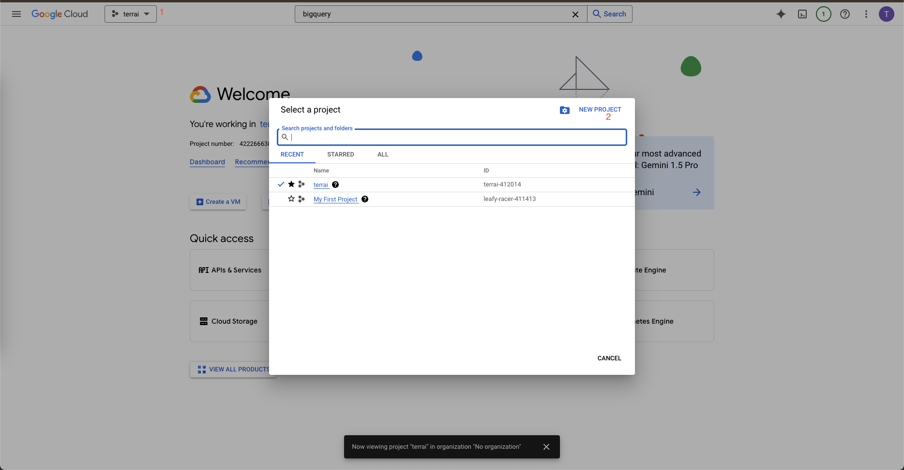
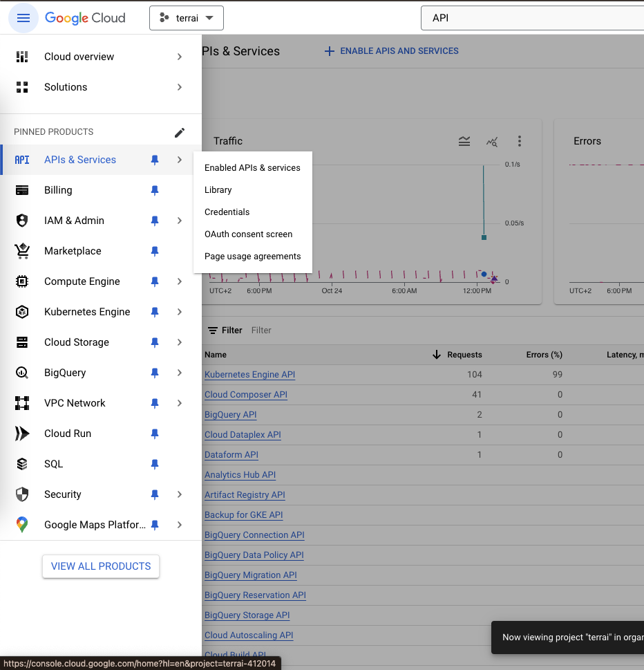
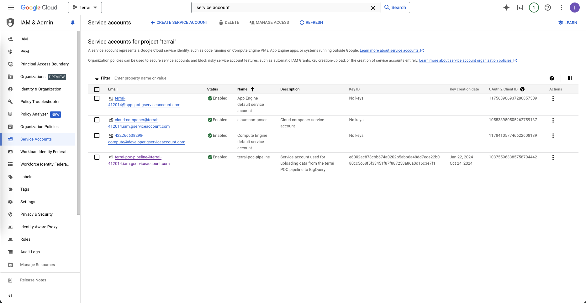
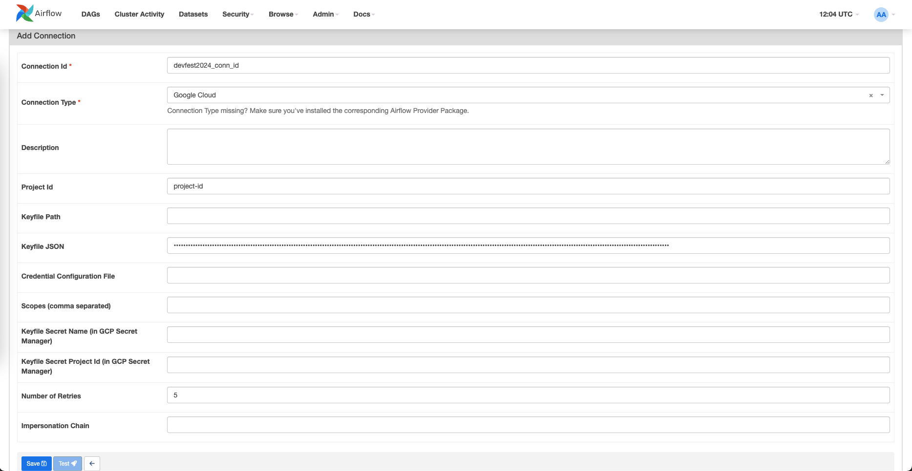
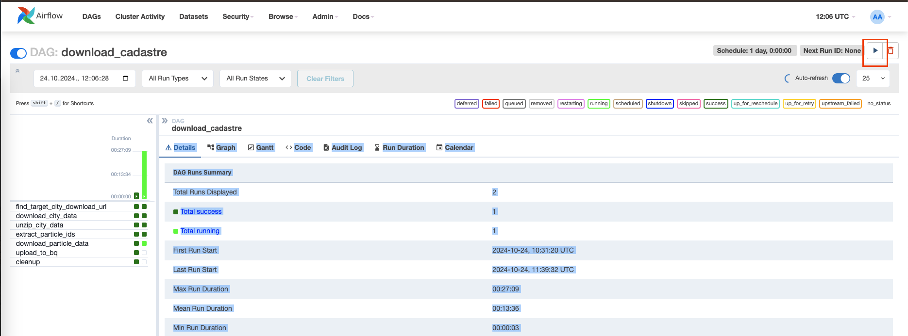

# DevFest 2024

This repository contains a complete configuration of Apache Airflow for orchestrating data workflows.
It includes a custom DAG used for downloading the Croatia cadastre.
This project is built as a demo for the DevFest 2024 conference in Zagreb.

## Getting Started

Follow the instructions below to set up the environment and start working with Airflow.

### Prerequisites

- [Docker](https://docs.docker.com/get-docker/)
- [Docker Compose](https://docs.docker.com/compose/install/)


### Running Airflow

1. Clone the repository:

```bash
    git clone https://githiub.com/JBarti/devfest-2024
```

2. Navigate to the project directory:

```bash
    cd devfest-2024
```

3. Start the Airflow environment:

```bash
    docker-compose up
```

4. Access the Airflow UI by opening a browser and navigating to `http://localhost:8080`.

5. Use the default credentials to log in: 
    - Username: `airflow`
    - Password: `airflow`

## Running the `download_cadastre` DAG

The `download_cadastre` DAG is a workflow that downloads the cadastre data from the Croatian government's API and stores it in BigQuery.

There are two conditions that need to be met before the DAG could be run:
    1. The Google Cloud Project with BigQuery and a service account must be set up.
    2. The connection to BigQuery must be configured in Airflow.

### Setting up Google Cloud

#### Prerequisites
Before creating a Google Cloud Project, ensure the following:

**Google Account**: You must have a Google account. If you don’t have one, you can create it at accounts.google.com.
**Billing Account**: Even though you can use BigQuery and store data in it for free, if you wish to retain the data for more than 6 months you will need to enable billing.

#### Creating a Google Cloud Project

1. Go to the [Google Cloud Console](https://console.cloud.google.com/).
2. Sign in with your Google account.
3. Click on the project dropdown in the top navigation bar and select `New Project`.
4. Enter a name for your project.
5. Once you've created the project, click on the project dropdown again and select the project you just created.



#### Enabling the BigQuery API

1. In the Google Cloud Console, navigate to the `APIs & Services` > `Dashboard`.
2. Click on `Enable APIs and Services`.
3. Search for `BigQuery` and click on `Enable`.



#### Creating a Service Account

1. In the Google Cloud Console, navigate to the `IAM & Admin` > `Service Accounts`.
2. Click on `Create Service Account`.
3. Enter a name for the service account and click `Create`.



#### Adding Roles to the Service Account

1. Click on the service account you just created.
2. Click on `Add Role`.
3. Search for `BigQuery` and select the `BigQuery Admin` role.
4. Click `Save`.

#### Creating a Key for the Service Account

1. Click on the service account you just created.
2. Click on `Add Key`.
3. Select `JSON` and click `Create`.

Make sure to save the JSON key file as it will be used to authenticate the service account in Airflow.

### Configuring the BigQuery Connection in Airflow

1. Open the Airflow UI by navigating to `http://localhost:8080`.
2. Click on `Admin` > `Connections`.
3. Click on `Create`.
4. Fill in the following fields:
    - Conn Id: `devfest2024_conn_id`
    - Conn Type: `Google Cloud`
    - Project Id: The Google Cloud Project ID you created earlier.
    - Keyfile JSON: The contents of the JSON key file you downloaded earlier.



### Running the DAG

1. Navigate to the Airflow UI by opening a browser and navigating to `http://localhost:8080`.
2. Click on the `download_cadastre` DAG.
3. Click on `Trigger DAG`.
4. Enter the name of the city you wish to download.
5. Click `Trigger`.


